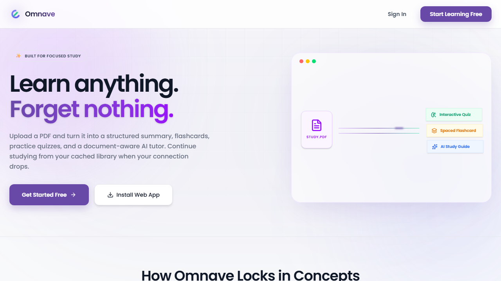
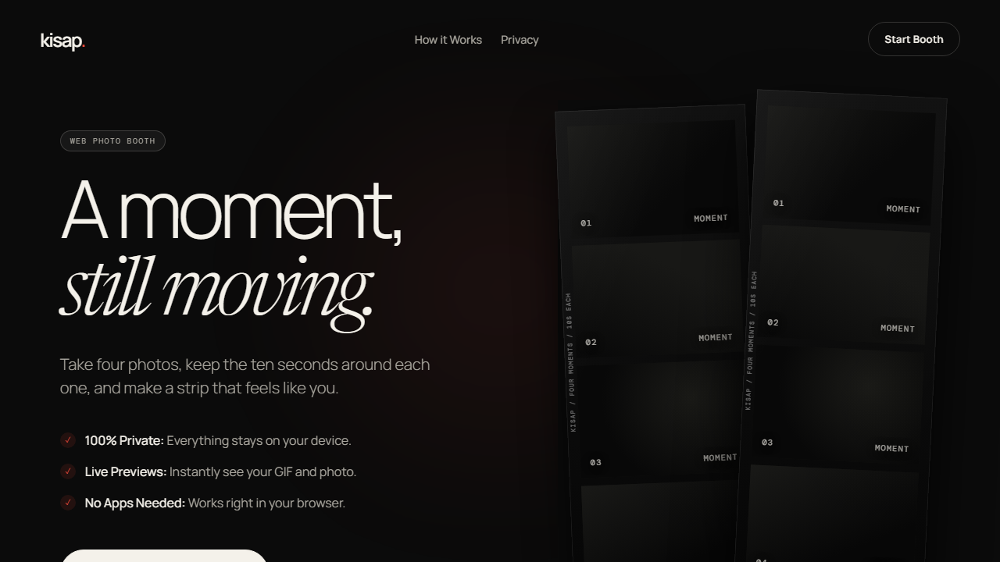
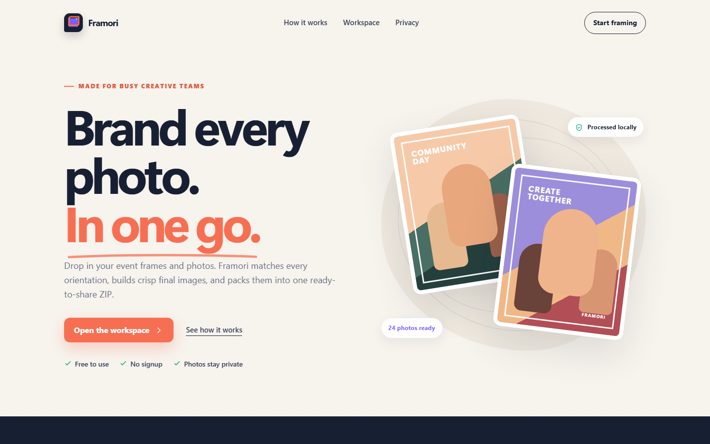
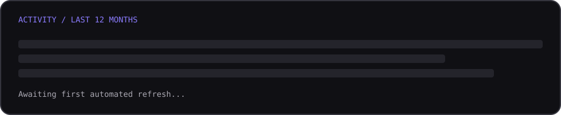

<div align="center">
  
</div>

<br>

<div align="center">
  <a href="https://bryan-jhade.vercel.app/">Portfolio</a>&nbsp;&nbsp;·&nbsp;&nbsp;
  <a href="mailto:bryanjhade.e@gmail.com">Email</a>&nbsp;&nbsp;·&nbsp;&nbsp;
  <a href="https://github.com/codebyjhade?tab=repositories">Repositories</a>
</div>

<br>

### `guest@github:~$ ls ./selected-work`

<table>
  <tr>
    <td width="33%" valign="top">
      <a href="https://omnave.vercel.app/"></a>
      <h3>Omnave</h3>
      <p>Turns course PDFs into study guides, spaced flashcards, quizzes, and document-aware AI conversations.</p>
      <p><a href="https://omnave.vercel.app/"><strong>Explore live ↗</strong></a></p>
    </td>
    <td width="33%" valign="top">
      <a href="https://kisap.vercel.app/"></a>
      <h3>kisap.</h3>
      <p>A private web photo booth that creates personalized photo strips and GIFs entirely on the user’s device.</p>
      <p><a href="https://kisap.vercel.app/"><strong>Explore live ↗</strong></a></p>
    </td>
    <td width="33%" valign="top">
      <a href="https://framori.vercel.app/"></a>
      <h3>Framori</h3>
      <p>Matches photos with portrait or landscape event frames and exports the finished batch in one ZIP.</p>
      <p><a href="https://framori.vercel.app/"><strong>Explore live ↗</strong></a></p>
    </td>
  </tr>
</table>

<br>

### `guest@github:~$ cat current-focus.txt`

```text
NOW       Building useful AI-powered products and thoughtful web experiences
STUDYING  BS Information Technology · AI-Powered Product Development
CARE      Clear interfaces · privacy · accessibility · reliable systems
STACK     TypeScript · React · Next.js · Python · FastAPI · Firebase · Supabase
TOOLS     Git · GitHub · Figma
```

<br>

### `guest@github:~$ ./activity.sh`

<div align="center">
  
</div>

<br>

### `guest@github:~$ contact --open`

I’m open to junior frontend, full-stack, and AI-powered product roles—as well as focused collaborations where thoughtful design and useful software matter.

**[Send an email](mailto:bryanjhade.e@gmail.com)** · **[Visit my portfolio](https://bryan-jhade.vercel.app/)**

<sub>Designed and built by Bryan Jhade Bugauisan-Ebuan · Philippines</sub>
